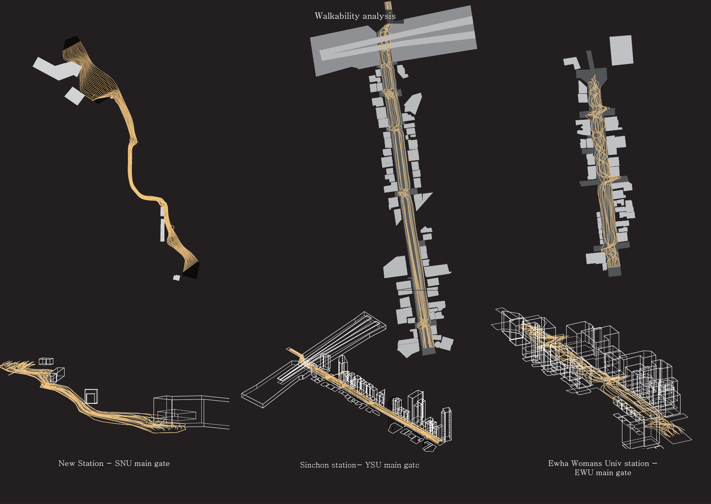

# define-walkability-gh

This is a grasshopper cluster that analyzes how 'walkable' the given surface is.

Walkable, here, is defined in two ways. 

1. Whether the path is indirect and inclined
2. How many intersection can be happened( how interesting the path is)

This Grasshopper definition is meaningful because it deals the path gemetrically, in a way that considers it's dimensions and 3D shape. 
unlike other definitions or theory which deal the road as linear, topological thing. 
